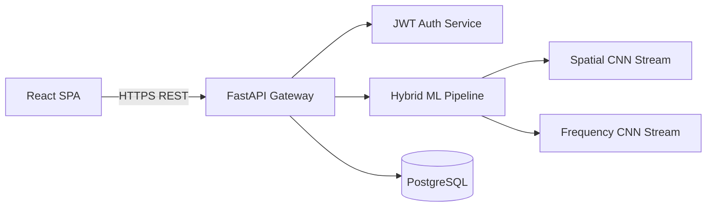

# DeepTrace — AI Image Detection SaaS

[](https://github.com/)
[](https://github.com/)
[](https://www.python.org/)
[](https://reactjs.org/)
[](https://fastapi.tiangolo.com/)

DeepTrace is a production-ready, SaaS-grade platform designed to detect whether an image is AI-generated or genuine. Built with a scalable microservices architecture, it features a hybrid deep learning inference pipeline, visual explainability, secure role-based authentication, and a complete administrative suite for platform monitoring.

---

## 🚀 Key Features

* **Advanced Inference Engine**: Utilizes a dual-stream architecture combining spatial CNN analysis and frequency domain mapping to expose synthetic artifacts invisible to the human eye.
* **Visual Explainability**: Provides transparent results through Grad-CAM heatmaps and frequency spectrogram overlays, showing *why* an image was flagged.
* **Complete SaaS Experience**: Full authentication flow (JWT, bcrypt), user profiles, and persistent prediction history.
* **Enterprise Security**: Role-based access control (RBAC), strict CORS, SlowAPI rate limiting, and immutable audit logs for administrative actions.
* **Admin Analytics**: Comprehensive React Recharts dashboards tracking platform usage, detection confidence trends, and system health in real-time.

---

## 📊 Why DeepTrace? (Feature Comparison)

| Feature | Standard CNN Checkers | DeepTrace Platform |
| :--- | :---: | :---: |
| **Spatial Artifact Detection** | ✅ | ✅ |
| **Frequency Spectrum (FFT) Detection** | ❌ | ✅ |
| **Visual Explainability (Grad-CAM)** | ❌ | ✅ |
| **Full User Authentication & History** | ❌ | ✅ |
| **Admin Analytics Dashboard** | ❌ | ✅ |
| **Containerized Microservices** | ❌ | ✅ |

---

## 🏗️ Architecture Stack

DeepTrace is structured as a modern, decoupled microservices application.



* **Frontend**: React 18, Vite, TypeScript, Tailwind CSS, Framer Motion, Zustand.
* **Backend**: Python 3.10+, FastAPI, SQLAlchemy 2.0, Pydantic, Passlib (bcrypt), JWT.
* **Machine Learning**: PyTorch, OpenCV, SciPy, Pillow.
* **Infrastructure**: Docker, Docker Compose, PostgreSQL (Prod) / SQLite (Dev), Vercel + Render.

*(See [Architecture Documentation](./docs/architecture.md) for detailed diagrams and component breakdowns.)*

---

## ⏱️ Benchmarks & Performance

DeepTrace is optimized for CPU-first cloud environments (like Render or AWS Fargate) to minimize operational costs while maintaining low latency.

* **Inference Time (CPU - PyTorch)**: ~350ms per image.
* **RAM Footprint (Backend)**: ~250MB under load (Lightweight EfficientNet/ResNet backbone).
* **Frontend Bundle Size**: <200KB (Gzipped).
* **API Response Latency**: <50ms (Excluding ML inference).

---

## 🛠️ Quick Start (Docker)

The fastest way to launch the complete DeepTrace stack is via Docker Compose.

1. **Configure Environment**
Create a `.env` file in the root directory (use `infra/.env.example` as a template):
```bash
APP_ENV=development
JWT_SECRET_KEY=change_this_to_a_secure_random_string
ADMIN_EMAIL=admin@deeptrace.ai
ADMIN_PASSWORD=changeme123
DATABASE_URL=postgresql://deeptrace:deeptrace_dev@db:5432/deeptrace
```

2. **Launch the Stack**
```bash
cd infra
docker-compose up --build -d
```

3. **Access the Platform**
* **Frontend Application**: `http://localhost:3000`
* **API Documentation**: `http://localhost:8000/docs`

---

## 📈 Production Monitoring Recommendations

For a public launch, the following monitoring tools are highly recommended:
1. **Sentry**: For real-time frontend/backend crash reporting and unhandled exception tracing.
2. **Prometheus + Grafana**: To visualize the inference timing metrics already being logged via Python's `logging` framework.
3. **Logtail / Datadog**: For centralized log aggregation, particularly tracking the `DeepTrace.inference` logger to catch edge-case images causing ML pipeline degradation.

---

## 📚 Documentation

Detailed documentation is located in the `docs/` directory:

* [**Architecture Overview**](./docs/architecture.md)
* [**Deployment Guide**](./docs/deployment.md) & [**Cloud Deployment**](./docs/cloud_deployment.md)
* [**API Reference**](./docs/api.md)
* [**Model Setup**](./docs/model_setup.md)
* [**Testing Infrastructure**](./docs/testing.md)

---

## 🤝 Contributing
When contributing, please adhere to the existing architectural patterns:
1. Maintain strong typing (TypeScript/Pydantic).
2. Ensure UI components utilize the established Tailwind/Framer Motion design system.
3. Keep the backend decoupled (Routers -> Services -> Models).

## 📄 License
This project is licensed under the MIT License - see the LICENSE file for details.
