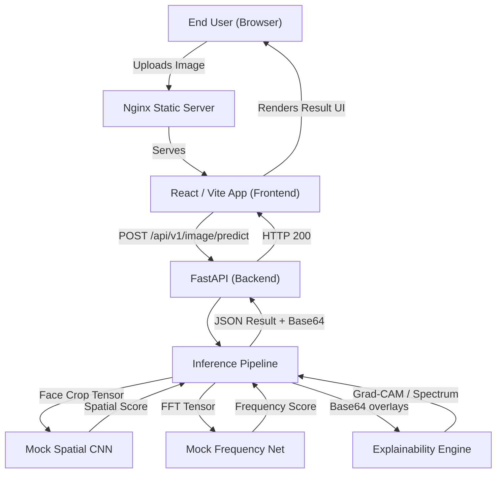

# DeepTrace Phase 1 MVP Architecture

The system uses a containerized multi-tier setup with a React frontend and a FastAPI (Python) backend serving a hybrid image evaluation model.

```mermaid
graph TD
    User["End User (Browser)"]
    subindex["Nginx Static Server"]
    ReactApp["React / Vite App (Frontend)"]
    FastAPI["FastAPI (Backend)"]
    InferenceService["Inference Pipeline"]
    SpatialModel["Mock Spatial CNN"]
    FrequencyModel["Mock Frequency Net"]
    Explainability["Explainability Engine"]
    
    User -->|Uploads Image| subindex
    subindex -->|Serves| ReactApp
    ReactApp -->|POST /api/v1/image/predict| FastAPI
    
    FastAPI --> InferenceService
    InferenceService -->|Face Crop Tensor| SpatialModel
    InferenceService -->|FFT Tensor| FrequencyModel
    
    SpatialModel -->|Spatial Score| InferenceService
    FrequencyModel -->|Frequency Score| InferenceService
    
    InferenceService -->|Base64 overlays| Explainability
    Explainability -->|Grad-CAM / Spectrum| InferenceService
    
    InferenceService -->|JSON Result + Base64| FastAPI
    FastAPI -->|HTTP 200| ReactApp
    ReactApp -->|Renders Result UI| User
```
