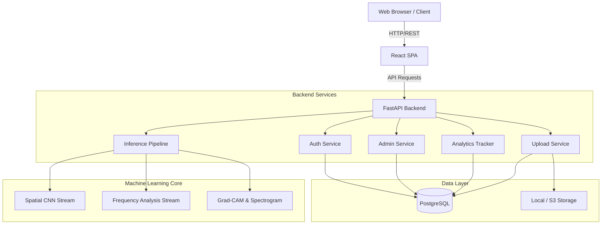

# DeepTrace Architecture

DeepTrace is designed as a modular, containerized SaaS platform capable of securely processing image authenticity verifications at scale. 

## High-Level System Architecture

## Component Breakdown

### 1. Frontend (React 18 + Vite)
- **State Management**: Uses Zustand for lightweight global state (Auth, UI preferences).
- **Styling**: Tailwind CSS combined with Framer Motion for responsive, dynamic glassmorphism UI.
- **Routing**: Protected, role-based routes (`GuestRoute`, `ProtectedRoute`, `AdminRoute`) ensuring strict client-side access control.

### 2. Backend (FastAPI)
- **Dependency Injection**: Enforces authentication (`get_current_user`), database session lifecycle (`get_db`), and role checks (`RequireRole("admin")`) natively.
- **Database ORM**: SQLAlchemy 2.0 interacting with PostgreSQL for production (SQLite compatible for local development).
- **Security Middleware**: Includes rate limiting (SlowAPI), secure HTTP headers, and strict CORS policies.

### 3. ML Inference Pipeline
DeepTrace utilizes a **Hybrid Dual-Stream Architecture**:
1. **Spatial Stream**: A CNN that detects pixel-level artifacts, unnatural textures, and blending errors typical in GANs/Diffusion models.
2. **Frequency Stream**: Converts images to the frequency domain (FFT) to detect periodic structural anomalies invisible to the human eye but left behind by generative upsamplers.
3. **Ensemble & Explainability**: The scores are dynamically ensembled. Grad-CAM visualizes spatial regions of interest, while a pseudo-color spectrogram visualizes frequency anomalies.

### 4. Persistence & Schema
- `User`: Standard user data, role (`user` vs `admin`), password hashes (bcrypt), and account status.
- `Upload`: Tracks file metadata, physical storage paths, and ownership.
- `Prediction`: Links an `Upload` to its inference results, confidence scores, execution time, and explainability map paths.
- `AuditLog`: Immutable ledger of security-critical actions (e.g., account deletion, admin access).
- `AnalyticsEvent`: Tracks platform usage metrics over time (e.g., signups, prediction types) without heavy log scraping.

## Scaling Considerations
As the platform transitions from Phase 1 (Image) to Phase 2 (Video):
- **Message Queues**: The Inference Pipeline should be decoupled from the FastAPI request/response lifecycle using Celery or RabbitMQ to handle long-running video frame processing.
- **Object Storage**: File storage should be migrated from the local filesystem to an S3-compatible blob store.
- **Caching**: Frequently accessed user history and dashboard analytics can be cached via Redis.
